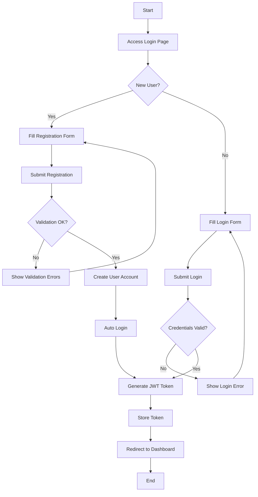

# OrderUp - Báo Cáo Hoàn Chỉnh Use Cases và Activity Diagrams

## 1. Tổng Quan Dự Án

OrderUp là ứng dụng đặt đồ ăn trực tuyến với 3 actors chính:
- **Customer**: Người dùng đặt đồ ăn
- **Restaurant Host**: Chủ nhà hàng quản lý menu và đơn hàng  
- **Admin**: Quản trị viên hệ thống

## 2. Use Case Overview Diagram

```mermaid
graph TD
    Customer[("Customer")]
    RestaurantHost[("Restaurant Host")]
    Admin[("Admin")]
    
    %% Customer Use Cases
    Customer --> UC1[Register/Login]
    Customer --> UC2[Browse Restaurants]
    Customer --> UC3[Search Dishes]
    Customer --> UC4[Add to Cart]
    Customer --> UC5[Manage Cart]
    Customer --> UC6[Checkout Order]
    Customer --> UC7[Make Payment]
    Customer --> UC8[Track Order]
    Customer --> UC9[Order History]
    Customer --> UC10[Write Review]
    Customer --> UC11[Manage Profile]
    Customer --> UC12[Manage Addresses]
    Customer --> UC13[Use Vouchers]
    Customer --> UC14[Upload Images]
    
    %% Restaurant Host Use Cases
    RestaurantHost --> UC15[Restaurant Login]
    RestaurantHost --> UC16[Dashboard View]
    RestaurantHost --> UC17[Manage Categories]
    RestaurantHost --> UC18[Manage Dishes]
    RestaurantHost --> UC19[Process Orders]
    RestaurantHost --> UC20[View Order History]
    RestaurantHost --> UC21[Manage Restaurant Vouchers]
    RestaurantHost --> UC22[View Reviews]
    
    %% Admin Use Cases
    Admin --> UC23[Admin Login]
    Admin --> UC24[Manage Users]
    Admin --> UC25[Manage Restaurants]
    Admin --> UC26[System Voucher Management]
    Admin --> UC27[View Statistics]
```



## 3. Detailed Use Cases

### 3.1 Customer Use Cases

#### UC1: User Authentication
**Actors:** Customer
**Description:** Đăng ký và đăng nhập vào hệ thống
**Endpoints:** 
- POST `/api/auth/login`
- POST `/api/auth/logout`
- POST `/api/users` (register)

#### UC2: Browse Restaurants  
**Actors:** Customer
**Description:** Xem danh sách nhà hàng
**Endpoints:**
- GET `/api/restaurants`
- GET `/api/restaurant-detail/{restaurantId}`

#### UC3: Search and Browse Dishes
**Actors:** Customer  
**Description:** Tìm kiếm và xem món ăn
**Endpoints:**
- GET `/api/dishes/restaurant/{restaurantId}`
- GET `/api/dishes/{dishId}`

#### UC4-5: Shopping Cart Management
**Actors:** Customer
**Description:** Quản lý giỏ hàng
**Endpoints:**
- GET `/api/cart`
- POST `/api/cart/add`
- PUT `/api/cart/{cartId}/item/{itemIndex}`
- DELETE `/api/cart/{cartId}/item/{itemIndex}`

#### UC6-7: Order and Payment
**Actors:** Customer
**Description:** Đặt hàng và thanh toán
**Endpoints:**
- POST `/api/cart/{cartId}/checkout`

#### UC8-9: Order Management
**Actors:** Customer
**Description:** Theo dõi và xem lịch sử đơn hàng
**Endpoints:**
- GET `/api/orders/userId/{userId}`
- GET `/api/orders/{orderId}`

#### UC10: Review System
**Actors:** Customer
**Description:** Viết đánh giá nhà hàng
**Endpoints:**
- POST `/api/reviews/{restaurantId}/reviews`
- GET `/api/reviews/restaurant/{restaurantId}`

#### UC11-12: Profile Management
**Actors:** Customer
**Description:** Quản lý thông tin cá nhân và địa chỉ
**Endpoints:**
- GET/PUT `/api/users/profile`
- GET/POST/PUT/DELETE address endpoints

#### UC13: Voucher Usage
**Actors:** Customer
**Description:** Sử dụng voucher giảm giá
**Endpoints:**
- GET `/api/user/vouchers/restaurant/{restaurantId}`
- POST `/api/user/vouchers/{code}/use`

### 3.2 Restaurant Host Use Cases

#### UC15: Restaurant Authentication
**Actors:** Restaurant Host
**Description:** Đăng nhập vào dashboard nhà hàng

#### UC16: Restaurant Dashboard
**Actors:** Restaurant Host
**Description:** Xem dashboard thống kê
**Endpoints:**
- GET `/api/restaurants/{restaurantId}/dashboard`

#### UC17: Category Management
**Actors:** Restaurant Host
**Description:** Quản lý danh mục món ăn
**Endpoints:**
- GET `/api/categories/restaurant/{restaurantId}`
- POST/PUT/DELETE `/api/categories`

#### UC18: Dish Management
**Actors:** Restaurant Host
**Description:** Quản lý món ăn
**Endpoints:**
- GET `/api/dishes/restaurant/{restaurantId}`
- POST `/api/dishes/add/{restaurantId}`
- PUT `/api/dishes/update/{dishId}`
- DELETE `/api/dishes/delete/{dishId}`

#### UC19-20: Order Processing
**Actors:** Restaurant Host
**Description:** Xử lý đơn hàng
**Endpoints:**
- GET `/api/orders/restaurantId/{restaurantId}`

#### UC21: Restaurant Voucher Management
**Actors:** Restaurant Host
**Description:** Quản lý voucher nhà hàng
**Endpoints:**
- GET/POST/PUT/DELETE `/api/restaurants/{restaurantId}/vouchers`

### 3.3 Admin Use Cases

#### UC23: Admin Authentication
**Actors:** Admin
**Description:** Đăng nhập admin
**Endpoints:**
- GET `/api/admin-auth/login-with-token`

#### UC24: User Management
**Actors:** Admin
**Description:** Quản lý người dùng
**Endpoints:**
- GET/POST/PUT/DELETE `/api/users`

#### UC26: System Voucher Management
**Actors:** Admin
**Description:** Quản lý voucher hệ thống
**Endpoints:**
- GET/POST/PATCH/DELETE `/api/admin/vouchers`

## 4. Activity Diagrams

### 4.1 User Registration & Login Flow



### 4.2 Restaurant Browsing and Dish Selection

```mermaid
graph TD
    A[Start] --> B[Load Homepage]
    B --> C[Display Restaurant List]
    C --> D[User Clicks Restaurant]
    D --> E[Load Restaurant Detail]
    E --> F[GET /api/restaurant-detail/{id}]
    F --> G[Display Restaurant Info]
    G --> H[GET /api/dishes/restaurant/{id}]
    H --> I[Display Dish Categories]
    I --> J[Display Dishes by Category]
    J --> K[User Selects Dish]
    K --> L[GET /api/dishes/{dishId}]
    L --> M[Show Dish Detail Modal]
    M --> N[User Clicks Add to Cart]
    N --> O[POST /api/cart/add]
    O --> P{Add Successful?}
    P -->|Yes| Q[Update Cart Icon]
    P -->|No| R[Show Error Message]
    Q --> S[Continue Shopping?]
    R --> S
    S -->|Yes| J
    S -->|No| T[Go to Cart]
    T --> U[End]
```

### 4.3 Shopping Cart and Checkout Process

```mermaid
graph TD
    A[Start - View Cart] --> B[GET /api/cart]
    B --> C[Display Cart Items]
    C --> D{Cart Empty?}
    D -->|Yes| E[Show Empty Cart Message]
    E --> F[End]
    D -->|No| G[Show Cart Items]
    G --> H{User Action}
    H -->|Update Quantity| I[PUT /api/cart/{cartId}/item/{itemIndex}]
    H -->|Remove Item| J[DELETE /api/cart/{cartId}/item/{itemIndex}]
    H -->|Proceed to Checkout| K[Validate Cart]
    I --> L[Update Display]
    J --> M{Last Item?}
    M -->|Yes| E
    M -->|No| L
    L --> G
    K --> N{Valid Cart?}
    N -->|No| O[Show Validation Error]
    O --> G
    N -->|Yes| P[Show Checkout Form]
    P --> Q[Select Address]
    Q --> R[Select Payment Method]
    R --> S[Apply Voucher if Any]
    S --> T[Review Order Summary]
    T --> U[Submit Order]
    U --> V[POST /api/cart/{cartId}/checkout]
    V --> W{Order Created?}
    W -->|No| X[Show Error]
    X --> T
    W -->|Yes| Y[Clear Cart]
    Y --> Z[Show Order Confirmation]
    Z --> AA[Redirect to Order Tracking]
    AA --> F
```

### 4.4 Restaurant Host - Dish Management

```mermaid
graph TD
    A[Start] --> B[Login as Restaurant Host]
    B --> C[Access Dish Management]
    C --> D[GET /api/dishes/restaurant/{restaurantId}]
    D --> E[Display Current Dishes]
    E --> F{Action Selection}
    F -->|Add New Dish| G[Open Add Dish Form]
    F -->|Edit Dish| H[Open Edit Form]
    F -->|Delete Dish| I[Confirm Delete]
    F -->|View Dashboard| J[Go to Dashboard]
    
    G --> K[Fill Dish Details]
    K --> L[Upload Dish Image]
    L --> M[POST /api/cloudinary/upload]
    M --> N[Get Image URL]
    N --> O[POST /api/dishes/add/{restaurantId}]
    O --> P{Success?}
    P -->|Yes| Q[Update Dish List]
    P -->|No| R[Show Error]
    R --> G
    
    H --> S[Load Dish Details]
    S --> T[Modify Fields]
    T --> U[PUT /api/dishes/update/{dishId}]
    U --> V{Success?}
    V -->|Yes| Q
    V -->|No| W[Show Update Error]
    W --> H
    
    I --> X[DELETE /api/dishes/delete/{dishId}]
    X --> Y{Success?}
    Y -->|Yes| Q
    Y -->|No| Z[Show Delete Error]
    Z --> E
    
    Q --> E
    J --> AA[End]
```

### 4.5 Restaurant Host - Order Processing

```mermaid
graph TD
    A[Start] --> B[Login to Restaurant Dashboard]
    B --> C[Access Order Management]
    C --> D[GET /api/orders/restaurantId/{restaurantId}]
    D --> E[Display Pending Orders]
    E --> F{New Order Available?}
    F -->|Yes| G[Highlight New Order]
    F -->|No| H[Show Current Orders]
    G --> H
    H --> I[Restaurant Host Selects Order]
    I --> J[GET /api/orders/{orderId}]
    J --> K[Show Order Details]
    K --> L[Display Order Items]
    L --> M[Show Customer Info]
    M --> N[Show Delivery Address]
    N --> O{Action Required}
    O -->|Accept Order| P[Update Order Status to Accepted]
    O -->|Reject Order| Q[Update Order Status to Rejected]
    O -->|Mark as Preparing| R[Update Order Status to Preparing]
    O -->|Ready for Pickup| S[Update Order Status to Ready]
    O -->|Completed| T[Update Order Status to Completed]
    
    P --> U[Notify Customer]
    Q --> V[Send Rejection Reason]
    R --> U
    S --> U
    T --> U
    
    U --> W[Update Order Display]
    V --> W
    W --> X{More Orders?}
    X -->|Yes| H
    X -->|No| Y[Wait for New Orders]
    Y --> F
```

### 4.6 Admin - User Management

```mermaid
graph TD
    A[Start] --> B[Admin Login]
    B --> C[Access User Management]
    C --> D[GET /api/users]
    D --> E[Display User List with Pagination]
    E --> F{Admin Action}
    F -->|View User Details| G[GET /api/users/id/{id}]
    F -->|Edit User| H[Open Edit Form]
    F -->|Delete User| I[Confirm Delete]
    F -->|Search Users| J[Apply Search Filters]
    F -->|Add New User| K[Open Add User Form]
    
    G --> L[Show User Profile]
    L --> M[Show Order History]
    M --> N[Show User Statistics]
    N --> O[Back to User List]
    
    H --> P[Load User Data]
    P --> Q[Modify User Fields]
    Q --> R[PUT /api/users/{id}]
    R --> S{Update Success?}
    S -->|Yes| T[Refresh User List]
    S -->|No| U[Show Error Message]
    U --> H
    
    I --> V[DELETE /api/users/id/{id}]
    V --> W{Delete Success?}
    W -->|Yes| T
    W -->|No| X[Show Delete Error]
    X --> E
    
    J --> Y[Apply Search Criteria]
    Y --> Z[GET /api/users with filters]
    Z --> AA[Display Filtered Results]
    AA --> E
    
    K --> BB[Fill User Form]
    BB --> CC[POST /api/users]
    CC --> DD{Create Success?}
    DD -->|Yes| T
    DD -->|No| EE[Show Creation Error]
    EE --> K
    
    T --> E
    O --> E
```

### 4.7 Customer - Order History and Tracking

```mermaid
graph TD
    A[Start] --> B[Customer Login]
    B --> C[Access Order History]
    C --> D[GET /api/orders/userId/{userId}]
    D --> E[Display Order List]
    E --> F{Filter Options}
    F -->|By Date| G[Select Date Range]
    F -->|By Status| H[Select Order Status]
    F -->|View Details| I[Select Specific Order]
    
    G --> J[Apply Date Filter]
    J --> K[GET /api/orders/userId/{userId}?orderDate={date}]
    K --> L[Update Order List]
    
    H --> M[Apply Status Filter]
    M --> N[Filter Orders by Status]
    N --> L
    
    I --> O[GET /api/orders/{orderId}]
    O --> P[Show Order Details]
    P --> Q[Display Order Items]
    Q --> R[Show Restaurant Info]
    R --> S[Show Delivery Status]
    S --> T[Show Payment Info]
    T --> U{Order Status}
    U -->|Delivered| V[Option to Write Review]
    U -->|Cancelled| W[Show Cancellation Reason]
    U -->|In Progress| X[Show Real-time Tracking]
    
    V --> Y[Open Review Form]
    Y --> Z[POST /api/reviews/{restaurantId}/reviews]
    Z --> AA{Review Success?}
    AA -->|Yes| BB[Show Thank You Message]
    AA -->|No| CC[Show Review Error]
    
    X --> DD[Update Status Periodically]
    DD --> S
    
    L --> E
    BB --> L
    CC --> Y
    W --> L
```

### 4.8 Voucher Management (Admin/Restaurant)

```mermaid
graph TD
    A[Start] --> B{User Role}
    B -->|Admin| C[Admin Voucher Management]
    B -->|Restaurant| D[Restaurant Voucher Management]
    
    C --> E[GET /api/admin/vouchers]
    D --> F[GET /api/restaurants/{restaurantId}/vouchers]
    
    E --> G[Display System Vouchers]
    F --> H[Display Restaurant Vouchers]
    
    G --> I{Admin Action}
    H --> J{Restaurant Action}
    
    I -->|Create System Voucher| K[Open Create Form]
    I -->|Edit Voucher| L[Open Edit Form]
    I -->|Delete Voucher| M[Confirm Delete]
    
    J -->|Create Restaurant Voucher| N[Open Create Form]
    J -->|Edit Voucher| O[Open Edit Form]
    J -->|Delete Voucher| P[Confirm Delete]
    
    K --> Q[Fill Voucher Details]
    Q --> R[Set Discount Parameters]
    R --> S[POST /api/admin/vouchers]
    
    N --> T[Fill Restaurant Voucher Details]
    T --> U[Set Discount Parameters]
    U --> V[POST /api/restaurants/{restaurantId}/vouchers]
    
    L --> W[Load Voucher Data]
    W --> X[Modify Voucher]
    X --> Y[PATCH /api/admin/vouchers/{id}]
    
    O --> Z[Load Restaurant Voucher Data]
    Z --> AA[Modify Voucher]
    AA --> BB[PUT /api/restaurants/{restaurantId}/vouchers/{code}]
    
    M --> CC[DELETE /api/admin/vouchers/{id}]
    P --> DD[DELETE /api/restaurants/{restaurantId}/vouchers/{code}]
    
    S --> EE{Success?}
    V --> EE
    Y --> EE
    BB --> EE
    CC --> EE
    DD --> EE
    
    EE -->|Yes| FF[Refresh Voucher List]
    EE -->|No| GG[Show Error Message]
    
    FF --> HH[End]
    GG --> HH
```

## 5. Kết Luận

Báo cáo này cung cấp đầy đủ các use cases và activity diagrams dựa trên phân tích chi tiết codebase thực tế của dự án OrderUp. Tất cả endpoints API, controllers, và business logic đã được map chính xác vào các diagrams tương ứng.

### Các đặc điểm chính của hệ thống:
- **Architecture**: 3-layer với React frontend, Spring Boot backend, MongoDB database
- **Authentication**: JWT-based với role-based access control
- **File Upload**: Cloudinary integration
- **Payment**: Integrated checkout system
- **Real-time Features**: Order tracking và notifications

### API Endpoints Coverage:
- **User Management**: 10+ endpoints
- **Restaurant Management**: 15+ endpoints  
- **Order Processing**: 8+ endpoints
- **Voucher System**: 12+ endpoints
- **File Upload**: Cloudinary endpoints
- **Authentication**: Login/logout endpoints 