# OrderUp - Báo Cáo Hoàn Chỉnh Use Cases và Activity Diagrams (Cập nhật 2025)

## 1. Tổng Quan Dự Án

OrderUp là ứng dụng đặt đồ ăn trực tuyến với 3 actors chính:
- **Customer**: Người dùng đặt đồ ăn (role: "user")
- **Restaurant Host**: Chủ nhà hàng quản lý menu và đơn hàng (role: "restaurantHost")
- **Admin**: Quản trị viên hệ thống với web interface hoàn chỉnh (role: "admin")

**Kiến trúc hệ thống:**
- **Frontend**: React (Vite) - Port 5173
- **Backend**: Spring Boot (Java 21) - Port 8080  
- **Database**: MongoDB Atlas
- **File Storage**: Cloudinary
- **Authentication**: JWT + Session-based cho admin web interface

## 2. Use Case Overview Diagram

```mermaid
graph TD
    Customer[("Customer")]
    RestaurantHost[("Restaurant Host")]
    Admin[("Admin")]
    
    %% Customer Use Cases
    Customer --> UC1[Register/Login]
    Customer --> UC2[Browse Restaurants]
    Customer --> UC3[Search Dishes]
    Customer --> UC4[Multiple Shopping Carts]
    Customer --> UC5[Manage Multiple Carts]
    Customer --> UC6[Checkout Selected Cart]
    Customer --> UC7[Make Payment]
    Customer --> UC8[Track Order]
    Customer --> UC9[Order History]
    Customer --> UC10[Write Review for Order]
    Customer --> UC11[Manage Profile]
    Customer --> UC12[Manage Addresses]
    Customer --> UC13[Use Vouchers]
    Customer --> UC14[Upload Images]
    
    %% Restaurant Host Use Cases
    RestaurantHost --> UC15[Restaurant Login]
    RestaurantHost --> UC16[Dashboard View]
    RestaurantHost --> UC17[Manage Categories]
    RestaurantHost --> UC18[Manage Dishes]
    RestaurantHost --> UC19[Process Orders]
    RestaurantHost --> UC20[View Order History]
    RestaurantHost --> UC21[Manage Restaurant Vouchers]
    RestaurantHost --> UC22[View Reviews]
    
    %% Admin Use Cases (Web Interface + API)
    Admin --> UC23[Admin Web Login]
    Admin --> UC24[Admin Dashboard Web]
    Admin --> UC25[Web User Management]
    Admin --> UC26[Web Restaurant Management]
    Admin --> UC27[Web Voucher Management]
    Admin --> UC28[System Statistics]
    Admin --> UC29[Token Session Setup]
```



## 3. Detailed Use Cases

### 3.1 Customer Use Cases

#### UC1: User Authentication
**Actors:** Customer
**Description:** Đăng ký và đăng nhập vào hệ thống
**Endpoints:** 
- POST `/api/auth/login`
- POST `/api/auth/logout`
- POST `/api/users` (register)

#### UC2: Browse Restaurants  
**Actors:** Customer
**Description:** Xem danh sách nhà hàng với pagination
**Endpoints:**
- GET `/api/shop?page={page}&size={size}` (with pagination)
- GET `/api/restaurant-detail/{restaurantId}`

#### UC3: Search and Browse Dishes
**Actors:** Customer  
**Description:** Tìm kiếm và xem món ăn theo nhà hàng
**Endpoints:**
- GET `/api/dishes/restaurant/{restaurantId}`
- GET `/api/dishes/{dishId}`

#### UC4-5: Multiple Shopping Cart Management **[CẬP NHẬT QUAN TRỌNG]**
**Actors:** Customer
**Description:** **Hệ thống cho phép lưu trữ nhiều giỏ hàng từ các nhà hàng khác nhau cùng lúc**
**Endpoints:**
- GET `/api/cart` - Lấy tất cả giỏ hàng của user (trả về List)
- GET `/api/cart/restaurant/{restaurantId}` - Lấy giỏ hàng của nhà hàng cụ thể
- POST `/api/cart/add` - Thêm món vào giỏ hàng của nhà hàng tương ứng
- PUT `/api/cart/{cartId}/item/{itemIndex}` - Cập nhật item trong giỏ
- DELETE `/api/cart/{cartId}/item/{itemIndex}` - Xóa item khỏi giỏ

**Behavior mới:**
- User có thể có multiple carts từ nhiều nhà hàng khác nhau
- Khi thêm món từ nhà hàng A, giỏ hàng của nhà hàng B vẫn được giữ nguyên
- Frontend hiển thị tất cả carts với checkbox để chọn cart nào checkout
- Mỗi cart có thông tin restaurant riêng biệt

#### UC6-7: Order and Payment
**Actors:** Customer
**Description:** Đặt hàng và thanh toán cho cart đã chọn
**Endpoints:**
- POST `/api/cart/{cartId}/checkout` - Checkout cart cụ thể

#### UC8-9: Order Management
**Actors:** Customer
**Description:** Theo dõi và xem lịch sử đơn hàng với pagination
**Endpoints:**
- GET `/api/orders/userId?page={page}&size={size}&orderDate={date}`
- GET `/api/orders/{orderId}`

#### UC10: Review System **[CẬP NHẬT]**
**Actors:** Customer
**Description:** Viết đánh giá cho đơn hàng đã hoàn thành
**Endpoints:**
- POST `/api/reviews/order/{orderId}` - Tạo review cho order cụ thể
- GET `/api/reviews/restaurant/{restaurantId}` - Xem reviews của nhà hàng

#### UC11-12: Profile Management
**Actors:** Customer
**Description:** Quản lý thông tin cá nhân và địa chỉ
**Endpoints:**
- GET/PUT `/api/users/profile`
- GET `/api/users/profile/id/{userId}`
- Address management endpoints

#### UC13: Voucher Usage **[CẬP NHẬT]**
**Actors:** Customer
**Description:** Sử dụng voucher từ nhiều nguồn
**Endpoints:**
- GET `/api/user/vouchers/restaurant/{restaurantId}` - Vouchers cho nhà hàng
- GET `/api/user/vouchers/{id}` - Chi tiết voucher

### 3.2 Restaurant Host Use Cases

#### UC15-16: Restaurant Authentication & Dashboard
**Actors:** Restaurant Host
**Description:** Đăng nhập và xem dashboard với thống kê
**Endpoints:**
- Sử dụng chung hệ thống auth với customer
- GET `/api/restaurants/{restaurantId}/dashboard`

#### UC17: Category Management
**Actors:** Restaurant Host
**Description:** Quản lý danh mục món ăn
**Endpoints:**
- GET `/api/categories/restaurant/{restaurantId}`
- POST/PUT/DELETE `/api/categories`

#### UC18: Dish Management
**Actors:** Restaurant Host
**Description:** Quản lý món ăn với upload ảnh
**Endpoints:**
- GET `/api/dishes/restaurant/{restaurantId}`
- POST `/api/dishes/add/{restaurantId}`
- PUT `/api/dishes/update/{dishId}`
- DELETE `/api/dishes/delete/{dishId}`
- POST `/api/cloudinary/upload` - Upload hình ảnh món ăn

#### UC19-20: Order Processing
**Actors:** Restaurant Host
**Description:** Xử lý đơn hàng realtime
**Endpoints:**
- GET `/api/orders/restaurantId/{restaurantId}`
- PUT `/api/orders/{orderId}/status` - Cập nhật trạng thái đơn hàng

#### UC21: Restaurant Voucher Management **[CẬP NHẬT]**
**Actors:** Restaurant Host  
**Description:** Quản lý voucher LOCAL của nhà hàng
**Endpoints:**
- GET/POST/PUT/DELETE `/api/restaurants/{restaurantId}/vouchers`

### 3.3 Admin Use Cases **[HOÀN TOÀN MỚI - WEB INTERFACE]**

#### UC23: Admin Web Authentication **[MỚI]**
**Actors:** Admin
**Description:** Đăng nhập admin qua web interface với session management
**Endpoints:**
- POST `/api/admin-auth/login` - Admin login qua form
- POST `/api/admin-auth/setup-session` - Thiết lập session từ JWT token
- GET `/api/admin-auth/validate` - Validate admin session
**Web Routes:**
- GET `/admin/` - Admin Dashboard
- Redirect `/` → `http://localhost:5173` (frontend)

#### UC24: Admin Dashboard Web **[MỚI]**
**Actors:** Admin
**Description:** Dashboard web hoàn chỉnh với UI
**Features:**
- Welcome dashboard với admin email
- Navigation đến các trang quản lý
- Statistics overview
- Responsive Bootstrap UI

#### UC25: Web User Management **[MỚI]**
**Actors:** Admin
**Description:** Giao diện web hoàn chỉnh để quản lý users
**Web Routes:**
- GET `/admin/users` - Danh sách users với pagination
- GET `/admin/users/{id}/view` - Chi tiết user
- GET `/admin/users/{id}/edit` - Form chỉnh sửa user
- POST `/admin/users/{id}/edit` - Submit chỉnh sửa
- GET `/admin/users/create` - Form tạo user mới
- POST `/admin/users/create` - Submit tạo user
- POST `/admin/users/{id}/delete` - Xóa user
- GET `/admin/users/search?userName={name}` - Tìm kiếm user

**Features:**
- CRUD operations với form validation
- Role management (user/restaurantHost/admin)
- User status management (active/inactive)
- Search và filter functionality
- Statistics dashboard

#### UC26: Web Restaurant Management **[MỚI]**
**Actors:** Admin
**Description:** Giao diện web quản lý nhà hàng
**Web Routes:**
- GET `/admin/restaurants` - Danh sách restaurants
- GET `/admin/restaurants/{id}/view` - Chi tiết restaurant  
- GET `/admin/restaurants/{id}/edit` - Form chỉnh sửa
- GET `/admin/restaurants/create` - Form tạo restaurant
- POST `/admin/restaurants/{id}/delete` - Xóa restaurant
- GET `/admin/restaurants/search?name={name}` - Tìm kiếm

**Features:**
- Restaurant verification management
- Host assignment
- Business info management
- Status control (active/inactive/pending)

#### UC27: Web Voucher Management **[MỚI]**
**Actors:** Admin
**Description:** Giao diện web quản lý voucher system-wide
**Web Routes:**
- GET `/admin/view/vouchers` - Voucher management page
**API Endpoints:**
- GET `/admin/view/api/vouchers` - Lấy tất cả vouchers
- GET `/admin/view/api/restaurants` - Lấy danh sách restaurants cho dropdown
- POST `/admin/view/api/vouchers` - Tạo voucher mới
- PATCH `/admin/view/api/vouchers/{id}` - Cập nhật voucher
- DELETE `/admin/view/api/vouchers/{id}` - Xóa voucher

**Features:**
- Interactive voucher cards UI
- Filter by type (GLOBAL/LOCAL) và status
- Real-time voucher management
- Restaurant selection for LOCAL vouchers

#### UC28: System Statistics **[MỚI]**
**Actors:** Admin
**Description:** Xem thống kê tổng quan hệ thống
**Features:**
- User statistics (total, new, active)
- Restaurant statistics
- Order analytics
- System performance metrics

#### UC29: Token Session Setup **[MỚI]**
**Actors:** Admin
**Description:** Chuyển đổi JWT token từ frontend thành admin session
**Flow:**
1. Admin login từ frontend React
2. Click "Trang Admin" trong ProfileSelect
3. Frontend gọi `/api/admin-auth/setup-session` với JWT token
4. Backend validate token và set admin session cookie
5. Redirect về admin dashboard

## 4. Activity Diagrams

### 4.1 Multiple Shopping Cart Management **[CẬP NHẬT QUAN TRỌNG]**

```mermaid
graph TD
    A[User Opens CartPage] --> B[GET /api/cart]
    B --> C[Display Multiple Restaurant Carts]
    C --> D{User Action}
    
    D -->|Select Cart for Checkout| E[Check Cart Selection]
    D -->|Add Item from Restaurant A| F[Check Existing Cart A]
    D -->|Add Item from Restaurant B| G[Check Existing Cart B]
    D -->|Remove Item| H[DELETE /api/cart/{cartId}/item/{index}]
    D -->|Update Quantity| I[PUT /api/cart/{cartId}/item/{index}]
    
    F --> J{Cart A Exists?}
    J -->|Yes| K[Add to Existing Cart A]
    J -->|No| L[Create New Cart A]
    
    G --> M{Cart B Exists?}
    M -->|Yes| N[Add to Existing Cart B]
    M -->|No| O[Create New Cart B]
    
    K --> P[Both Carts Preserved]
    L --> P
    N --> P
    O --> P
    
    P --> Q[Update Cart Display]
    H --> Q
    I --> Q
    
    E --> R{Valid Cart Selected?}
    R -->|Yes| S[Proceed to Checkout]
    R -->|No| T[Show Selection Error]
    
    S --> U[POST /api/cart/{selectedCartId}/checkout]
    U --> V[Order Created, Selected Cart Cleared]
    V --> W[Other Carts Remain Intact]
    
    T --> C
    Q --> C
    W --> X[End]
```

### 4.2 Admin Web Interface Flow **[HOÀN TOÀN MỚI]**

```mermaid
graph TD
    A[Admin Clicks 'Trang Admin'] --> B[Frontend: Check JWT Token]
    B --> C{Token Valid?}
    C -->|No| D[Redirect to Login]
    C -->|Yes| E[POST /api/admin-auth/setup-session]
    E --> F[Backend: Validate JWT & Set Cookie]
    F --> G[Redirect to /admin/]
    G --> H[Admin Dashboard Loads]
    
    H --> I{Admin Action}
    I -->|User Management| J[GET /admin/users]
    I -->|Restaurant Management| K[GET /admin/restaurants]
    I -->|Voucher Management| L[GET /admin/view/vouchers]
    
    J --> M[User List with Search/Filter]
    M --> N{User Action}
    N -->|View Details| O[GET /admin/users/{id}/view]
    N -->|Edit User| P[GET /admin/users/{id}/edit]
    N -->|Delete User| Q[POST /admin/users/{id}/delete]
    N -->|Create New| R[GET /admin/users/create]
    
    K --> S[Restaurant List with Management]
    L --> T[Interactive Voucher Dashboard]
    
    O --> U[Show User Profile & Orders]
    P --> V[Edit Form with Validation]
    R --> W[Create Form]
    
    V --> X[POST /admin/users/{id}/edit]
    W --> Y[POST /admin/users/create]
    
    X --> Z[Update Success & Refresh]
    Y --> Z
    Q --> Z
    
    Z --> M
```

### 4.3 Restaurant Host - Dish Management with Cloudinary

```mermaid
graph TD
    A[Restaurant Host Login] --> B[Access Dish Management]
    B --> C[GET /api/dishes/restaurant/{restaurantId}]
    C --> D[Display Current Dishes]
    D --> E{Action Selection}
    
    E -->|Add New Dish| F[Open Add Dish Form]
    E -->|Edit Dish| G[Open Edit Form]
    E -->|Delete Dish| H[Confirm Delete]
    
    F --> I[Fill Dish Details]
    I --> J[Select Image File]
    J --> K[POST /api/cloudinary/upload]
    K --> L{Upload Success?}
    L -->|No| M[Show Upload Error]
    L -->|Yes| N[Get Cloudinary URL]
    N --> O[POST /api/dishes/add/{restaurantId}]
    O --> P{Dish Created?}
    P -->|Yes| Q[Update Dish List]
    P -->|No| R[Show Error]
    
    G --> S[Load Dish Details]
    S --> T[Modify Fields & Image]
    T --> U[POST /api/cloudinary/upload] 
    U --> V[PUT /api/dishes/update/{dishId}]
    V --> W{Update Success?}
    W -->|Yes| Q
    W -->|No| X[Show Update Error]
    
    H --> Y[DELETE /api/dishes/delete/{dishId}]
    Y --> Z{Delete Success?}
    Z -->|Yes| AA[Also Delete from Cloudinary]
    Z -->|No| BB[Show Delete Error]
    
    AA --> Q
    M --> F
    R --> F
    X --> G
    BB --> D
    Q --> D
```

### 4.4 Customer - Review for Completed Order **[CẬP NHẬT]**

```mermaid
graph TD
    A[Customer Views Order History] --> B[GET /api/orders/userId]
    B --> C[Display Orders with Status]
    C --> D{Order Status}
    D -->|Completed & Not Reviewed| E[Show 'Write Review' Button]
    D -->|Already Reviewed| F[Show 'View Review' Button]
    D -->|In Progress| G[Show Order Status]
    
    E --> H[Customer Clicks Write Review]
    H --> I[Open Review Modal]
    I --> J[Fill Review Form]
    J --> K[Rating (1-5 stars)]
    K --> L[Write Comment]
    L --> M[Upload Review Images (Optional)]
    M --> N[POST /api/cloudinary/upload]
    N --> O[POST /api/reviews/order/{orderId}]
    O --> P{Review Created?}
    P -->|Yes| Q[Mark Order as Reviewed]
    P -->|No| R[Show Error Message]
    Q --> S[Update Order Display]
    R --> I
    S --> T[Thank You Message]
    T --> U[End]
```

## 5. API Endpoints Summary **[CẬP NHẬT HOÀN CHỈNH]**

### 5.1 Authentication
- POST `/api/auth/login` - User/Restaurant login
- POST `/api/admin-auth/login` - Admin web login
- POST `/api/admin-auth/setup-session` - JWT to session conversion
- GET `/api/admin-auth/validate` - Validate admin session

### 5.2 Shopping Cart **[MULTIPLE CARTS]**
- GET `/api/cart` - Get all user carts (List)
- GET `/api/cart/restaurant/{restaurantId}` - Get specific restaurant cart
- POST `/api/cart/add` - Add to restaurant-specific cart
- PUT `/api/cart/{cartId}/item/{itemIndex}` - Update cart item
- DELETE `/api/cart/{cartId}/item/{itemIndex}` - Remove cart item

### 5.3 Orders
- GET `/api/orders/userId?page={page}&size={size}` - User order history with pagination
- GET `/api/orders/restaurantId/{restaurantId}` - Restaurant orders
- POST `/api/cart/{cartId}/checkout` - Checkout specific cart
- PUT `/api/orders/{orderId}/status` - Update order status

### 5.4 Reviews **[CẬP NHẬT]**
- POST `/api/reviews/order/{orderId}` - Create review for order
- GET `/api/reviews/restaurant/{restaurantId}` - Get restaurant reviews

### 5.5 Vouchers **[MULTIPLE CONTROLLERS]**
- GET `/api/user/vouchers/restaurant/{restaurantId}` - User available vouchers
- GET/POST/PUT/DELETE `/api/restaurants/{restaurantId}/vouchers` - Restaurant vouchers
- GET/POST/PATCH/DELETE `/api/admin/vouchers` - Admin global vouchers
- GET `/admin/view/api/vouchers` - Web admin vouchers

### 5.6 Cloudinary
- POST `/api/cloudinary/upload` - Upload images
- DELETE `/api/cloudinary/delete/{publicId}` - Delete images

### 5.7 Admin Web Routes **[MỚI]**
- GET `/admin/` - Admin dashboard
- GET `/admin/users` - User management
- GET `/admin/restaurants` - Restaurant management  
- GET `/admin/view/vouchers` - Voucher management

## 6. Key Architecture Updates

### 6.1 Multiple Shopping Carts
- **Database**: Shopping carts collection với relationship `userId` + `restaurantId`
- **Frontend**: CartPage hiển thị multiple carts với selection mechanism
- **Behavior**: Carts từ các nhà hàng khác nhau được maintained độc lập

### 6.2 Admin Web Interface
- **Complete HTML templates** với Thymeleaf
- **Session-based authentication** cho web interface
- **JWT to Session conversion** mechanism
- **Bootstrap UI** với responsive design

### 6.3 Enhanced File Management
- **Cloudinary integration** cho dish images, user avatars, review images
- **Automatic cleanup** khi delete entities

### 6.4 Role-Based Access Control
- **Three distinct roles**: user, restaurantHost, admin
- **Different authentication flows** cho từng role
- **Web interface permissions** với admin-only access

## 7. Kết Luận

Hệ thống OrderUp đã được phát triển vượt xa thiết kế ban đầu với:

### Các tính năng chính:
- **Multiple Shopping Carts**: User có thể duy trì carts từ nhiều nhà hàng cùng lúc
- **Complete Admin Web Interface**: Dashboard hoàn chỉnh với CRUD operations
- **Enhanced Authentication**: JWT + Session hybrid approach
- **Cloudinary Integration**: Professional image management
- **Role-based Architecture**: Phân quyền rõ ràng cho 3 roles

### Technology Stack:
- **Frontend**: React (Vite) + React Router + Axios
- **Backend**: Spring Boot + Spring Security + MongoDB
- **Storage**: Cloudinary cho images
- **Database**: MongoDB Atlas với proper indexing
- **Authentication**: JWT tokens + Session cookies

### Performance Features:
- **Pagination** cho tất cả list endpoints
- **Optimized queries** với MongoDB aggregation
- **Real-time updates** cho order tracking
- **Responsive UI** với Bootstrap 5 